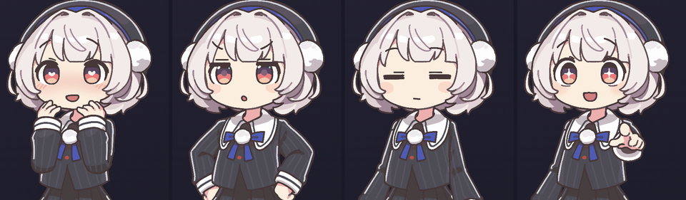
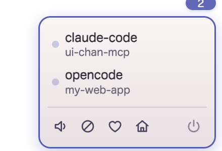

<p align="center">
  
</p>

<h1 align="center">雨衣ちゃんMCP</h1>

<p align="center">
  <sub>デスクトップの隅に住む、AI の体になるマスコット</sub><br>
  <sub><code>ui-chan-mcp</code></sub>
</p>

<p align="center">
  <sub>立ち絵素材：雨衣（うい）／坂本アヒル様 — 本プロジェクトは非公式のファン制作物です</sub>
</p>

<p align="center">
  
  
  
  
</p>

---

> [!IMPORTANT]
> **ご利用の前に必ずお読みください。**
>
> 本プロジェクトは**非公式のファン制作物**です。立ち絵素材「雨衣（うい）」の著作者である
> 坂本アヒル様、および VoiSona Talk を提供する株式会社テクノスピーチとは一切関係がありません。
>
> 本ソフトウェアはキャラクターを動かすための「器」にすぎず、**素材そのものは含まれていません**。
> ご利用にあたっては、**[雨衣キャラクターガイドライン](https://www.ui-roid.com/guidelines/)、
> 素材の利用規約、および VoiSona Talk と各ボイスライブラリの利用規約を必ずご自身でお読みいただき、
> その範囲内でご利用ください。** 二次創作のガイドラインは、キャラクターを扱う以上、
> このソフトウェアの MIT ライセンスより優先されます。
>
> とりわけ、**公序良俗に反する利用、特定の個人・団体を誹謗中傷する利用、権利者の名誉や
> ブランドを毀損する利用、公式を騙る（なりすます）行為は固くお断りします。**
> キャラクターに対する敬意を欠く使い方をしないでください。生成した音声や画像を公開・配信する場合は、
> 該当する規約の遵守と、必要なクレジット表記の確認をお願いします。
>
> 詳しい権利表記は[このページの末尾](#ライセンスと権利表記)にあります。

---

## はい、どうも～。ういです。

きみのデスクトップの隅に住んで、作業を眺めてる係。
**AI に繋ぐと、わたしがそのAIの体になる。** 表情を変えて、吹き出しで喋って、声も出すよ。

|  |  |
|:---:|---|
| 💥 | コマンドが失敗したら「あ、こけた。」って言う |
| 💤 | 長いこと放っておかれたら寝る。戻ってきたら起きる |
| 😠 | つついたら怒る。しつこいともっと怒る |
| 💗 | 仲良くなると態度が変わる。ういビームも撃つ（気分次第） |

> [!NOTE]
> **Claude Code / Claude Desktop / OpenCode / Cursor / VS Code / Hermes** で使えるよ。
> ただし **macOS 専用**。Windows と Linux では動かないから、そこはごめんね。

---

## `01` 入れかた

**やることは1つ、答えることが3つ。** どれも Enter で飛ばせるから、まず入れちゃっていいよ。

### わたしを入れる

```bash
npm install -g ui-chan-mcp
ui-chan
```

<sub>Node.js 22 以上が要ります。`ui-chan` が順番に聞いてくるので、答えるだけ。</sub>

### 聞かれること

| | 答えるもの | 飛ばすと |
|:---:|---|---|
| 🎨 | 立ち絵（`.psd` のパス） | のっぺらぼうのわたしが出る |
| 🔑 | 声の鍵（ユーザー名とパスワード） | 無言。吹き出しは出るし口も動く |
| 🔌 | どのアプリに入れるか | あとで `ui-chan install` で足せる |

**立ち絵**は [BOOTH](https://ui-roid.booth.pm/items/8593427) で雨衣の素材を買って、
ダウンロードした `.psd` のパスを答えてね。

**声の鍵**は [VoiSona Talk](https://voisona.com/talk/download/)（無料）を入れて、アプリの
**編集 → 環境設定 → API** で REST API を有効にする。そこで決めたユーザー名とパスワードのこと。

**アプリの選択**は <kbd>↑</kbd> <kbd>↓</kbd> で動いて <kbd>Space</kbd> で選んで、<kbd>Enter</kbd> で決定。

---

## `02` 使いかた

**繋いだら、もう終わり。** 次にそのアプリを開けば、画面の右下にわたしが出てくる。
あとは普通に作業して。勝手に喋るから。

### 右上のつまみ

<p align="center">
  
</p>

| ボタン | できること |
|:---:|---|
| 🔊 | 声だけ止める（ミュート） |
| ⊘ | いま喋ってるのを止める |
| ♡ | どのくらい仲良しか見る・変える |
| ⌂ | 定位置に戻して起き直す |
| ⏻ | 終了する（呼ばれても起きない） |

<sub>複数のセッションから繋がってるときは、そこに一覧が出るよ（どのツールの、どのプロジェクトか）。
更新があるときは、ダウンロードのアイコンが増える。</sub>

---

## `03` 困ったときは

> [!TIP]
> まず **`ui-chan doctor`**。何が足りないか、だいたいこれで分かるよ。

<details>
<summary><b>出てこない</b></summary>

`ui-chan start` で直接起こしてみて。それで出るなら繋ぎ方の問題。
普通はセッションを開けば勝手に出てくるはずなんだけどね。
</details>

<details>
<summary><b>声が出ない</b></summary>

VoiSona Talk が起きてないか、REST API が有効になってないか、鍵が違うか。
`ui-chan doctor` がどれか教えてくれる。→ [docs/TTS.md](docs/TTS.md)
</details>

<details>
<summary><b>うるさい／静かすぎる</b></summary>

`~/.ui-chan/config.json` で間隔を変えられる。→ [docs/TROUBLESHOOTING.md](docs/TROUBLESHOOTING.md)
</details>

<details>
<summary><b>止めたい</b></summary>

つまみの ⏻ を押す。それか `ui-chan stop`。
放っておいても、繋がってるアプリが全部いなくなれば勝手に寝るよ。
</details>

<sub>ほかは [docs/TROUBLESHOOTING.md](docs/TROUBLESHOOTING.md) にまとめてある。</sub>

---

## `04` もっと知りたい人へ

| 知りたいこと | どこ |
|---|---|
| 図解でセットアップを見たい | [docs/SETUP.html](docs/SETUP.html) |
| どのアプリにどう入るのか、詳しく | [docs/CLIENTS.md](docs/CLIENTS.md) |
| うまく動かない | [docs/TROUBLESHOOTING.md](docs/TROUBLESHOOTING.md) |
| 新しい表情を作りたい | [docs/CUE_AUTHORING.md](docs/CUE_AUTHORING.md) |
| わたしの性格を変えたい | [docs/PERSONA.md](docs/PERSONA.md) |
| **中のコードを直したい** | [docs/](docs/README.md) — 開発者向けの資料はこっちに全部ある |
| 手伝ってくれるなら | [CONTRIBUTING.md](CONTRIBUTING.md) — 歓迎するもの／お断りするもの |

---

## ライセンスと権利表記

以降は真面目な話です。**このリポジトリのソフトウェアと、そこから操作される素材・製品は
別々の権利者に属します。**

### 本ソフトウェア

MIT License（[LICENSE](LICENSE)）。Copyright (c) 2026 Uncle-Peke。
第三者の素材・製品についての表記は [NOTICE.md](NOTICE.md) にもまとめてあります。

MIT が適用されるのは**このリポジトリのコードと、同梱の設定・Cue 定義・ドキュメントのみ**です。
以下の2つは同梱しておらず、MIT の対象外です。

### 立ち絵素材「雨衣（うい）」

- **本プロジェクトは非公式のファン制作物です。** 坂本アヒル様および雨衣の公式プロジェクトとは
  関係がありません
- 著作者：**坂本アヒル**様
- 入手先：[BOOTH](https://ui-roid.booth.pm/items/8593427)
- **本リポジトリおよび npm パッケージには含まれていません。** 素材は二次配布が禁止されているため、
  利用者ご自身で入手し、`~/.ui-chan/assets/` に配置してください
- 利用にあたっては[雨衣キャラクターガイドライン](https://www.ui-roid.com/guidelines/)に従ってください。
  キャラクターの利用範囲・禁止事項（公序良俗に反する利用、権利侵害、なりすまし等）はガイドラインが
  優先します
- 同梱の `ui-chan.config.json` と `cues/*.json` は、この素材のレイヤー構成を前提とした
  **設定値（レイヤー名の文字列）**であり、素材そのものではありません
- 本ページに掲載しているスクリーンショット（`docs/images/`）は、ガイドラインが認める
  非営利の二次創作物としてクレジットを明記のうえ掲載しているものです。**素材データ（`.psd`）そのものは
  含めていません**
- **禁止事項**：公序良俗に反する利用、特定の個人・団体への誹謗中傷、権利者の名誉・ブランドを
  毀損する利用、公式・公認を騙る行為。これらはガイドライン以前の問題として固くお断りします

### VoiSona Talk

- 提供元：**株式会社テクノスピーチ**
- 入手先：[公式サイト](https://voisona.com/talk/download/)
- **本リポジトリおよび npm パッケージには含まれていません。** 本ソフトウェアは、利用者ご自身が
  インストールした VoiSona Talk の**ローカル REST API を呼び出しているだけ**で、
  アプリケーション本体・ボイスライブラリ・音声データのいずれも同梱・再配布していません
- 音声合成の利用条件（商用利用の可否、クレジット表記、ボイスライブラリごとの規約等）は、
  テクノスピーチ社および各ボイスライブラリ提供者の規約に従ってください
- 合成音声を公開・配信する場合は、利用したボイスライブラリの規約を必ずご確認ください

### 配布物への混入防止

上記2つが配布物に混入しないよう、`npm run check-package` が `npm pack` の実際の中身を検査し、
`.psd` / `assets/` / `.env` / アプリケーション・インストーラ・ネイティブバイナリ・音声データが
1件でも含まれる場合は公開処理を失敗させます。この検査は `prepublishOnly` から必ず実行されます。
