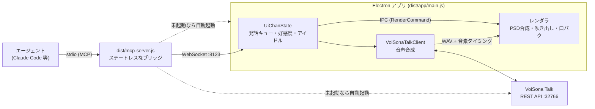

# ui-chan-mcp

デスクトップマスコットを MCP（Model Context Protocol）経由で操作するサーバ。
Claude Code や任意の MCP 対応エージェントから、マスコットの見た目（顔＋腕）と声をまとめて切り替え、
吹き出しでセリフを話させることができます。

- 表示層は Electron（透過・最前面・画面右下）
- 立ち絵は **PSDTool 形式の PSD**（`!`=必須レイヤー、`*`=ラジオ切替）をそのまま利用
- 見た目＋声は **Cue**（1ファイル=1つの完成した見た目＋声）という単位で管理。エージェント向けの
  視覚操作ツールは `set_cue` ただ1つ
- 発話キュー・複数エージェント同時接続に対応

> **立ち絵 PSD はリポジトリに含まれていません**（著作権保護された素材のため）。
> `~/.ui-chan/assets/` に PSDTool 対応の PSD を置くと動きます（`ui-chan` の対話セットアップが
> コピーしてくれます）。無い場合はプレースホルダで起動します。
> 同梱の `ui-chan.config.json` と `cues/*.json` は
> [雨衣（うい）立ち絵素材（坂本アヒル様）](https://ui-roid.booth.pm/items/8593427) のレイヤー構成向けです。
> 利用は[雨衣キャラクターガイドライン](https://www.ui-roid.com/guidelines/)の範囲でどうぞ。

## セットアップ

インストールは **`ui-chan` コマンド1本**です。クライアントごとの JSON を手で書く必要はありません。

```bash
git clone https://github.com/Uncle-Peke/ui-chan-mcp.git && cd ui-chan-mcp
npm install          # 依存の取得 + ビルド（prepare で dist/ まで作られる）
npx ui-chan          # 対話セットアップ（TUI）
```

`npx ui-chan` が順に面倒を見ます。

1. **ユーザーデータ `~/.ui-chan/` を作る** — 立ち絵PSD・資格情報・自作Cueの置き場
2. **立ち絵PSD の取り込み** — パスを聞いて `~/.ui-chan/assets/` にコピー（省略可。無ければプレースホルダ）
3. **VoiSona Talk の資格情報** — `~/.ui-chan/.env` に保存（省略可。音声なしで動きます）
4. **クライアント選択** — ↑↓ と Space で選んで Enter。選んだ設定ファイルに書き込みます（`.bak` を残します）
5. **doctor** — ビルド・PSD・資格情報・エンジン・各クライアントの登録状況を一覧表示

グローバルに入れておくと、どのディレクトリからでも `ui-chan` で呼べます（クローンからのローカル
インストールです。npm レジストリへの公開はしません — 後述）。

```bash
npm install -g .        # または npm link
ui-chan doctor
```

> **npm 公開はしません。** 外部ライセンスのものを配布物に混ぜないことが前提条件だからです。
> 立ち絵PSDは二次配布禁止の素材、VoiSona Talk とそのボイスライブラリはテクノスピーチ社の製品で、
> どちらも同梱できません（ういちゃんは、利用者が自分でインストールした VoiSona Talk を
> `open -a` で起こして、ローカルの REST API を叩いているだけです）。`package.json` の `files` は `assets/` を含まず、`private: true` で publish 自体を
> 塞いだうえ、`npm run check-package`（`prepublishOnly` から自動実行）が `npm pack` の実物を検査して
> `.psd` / `assets/` / `.env` / アプリ・インストーラ・ネイティブバイナリ・音声データが
> 1つでもあれば失敗します。配布はクローン（または
> `npx github:Uncle-Peke/ui-chan-mcp`）経由で、PSD は各自が BOOTH で入手して
> `~/.ui-chan/assets/` に置く、という形です。

### パッケージとユーザーデータは分かれています

これが**アップデートで壊れない**理由です。

| | 場所 | 中身 | 更新時 |
|---|---|---|---|
| パッケージ | クローン／`node_modules` | コード・同梱Cue・人格・設定の既定値 | **まるごと入れ替わる** |
| ユーザーデータ | `~/.ui-chan/`（`UI_CHAN_HOME` で変更可） | PSD・`.env`・`config.json`・自作Cue・人格の上書き | **触られない** |

解決はリソースごとで、上書きしたいものだけ書けば済みます。

- `config.json` … 同梱の `ui-chan.config.json` に**深いマージで上書き**。3行だけ書いても、後から増えた設定は継承されます
- `cues/` … 同梱Cueと**両方読み込み**、同名はユーザー側が勝つ。1つ足すのにカタログを複製する必要はありません
- `context/` … 同じくファイル名単位で上書き。`persona/ui-chan.md` は置けば置いた方が使われます
- `assets/` … PSD はライセンス上パッケージに入れられないので、実質ここだけ
- `.env` … 環境変数があればそちらが優先

### 対応クライアント

| id | クライアント | 書き込み先 |
|---|---|---|
| `claude-code` | Claude Code（MCPサーバ） | `claude mcp add -s user` |
| `claude-code-plugin` | Claude Code プラグイン（`/talk` `/mode` 等のスキル・サブエージェント・EventCueフック） | `~/.claude/plugins`（インストール後にクローンへ symlink 化） |
| `claude-desktop` | Claude Desktop | `claude_desktop_config.json` |
| `opencode` | OpenCode | `~/.config/opencode/opencode.json`（MCP＋EventCueプラグイン） |
| `cursor` | Cursor | `~/.cursor/mcp.json` |
| `vscode` | VS Code (Copilot Chat) | `User/mcp.json` |
| `hermes` | Hermes | `~/.hermes/mcp.json`（`UI_CHAN_HERMES_CONFIG` で変更可・パス未検証） |

一覧に無いクライアントには `ui-chan print <id>`（引数なしで汎用 stdio 設定）が貼り付け用の
スニペットを出します。**新しいホストへの対応は `tools/setup/clients.mjs` に1エントリ足すだけ**で、
インストーラを書き足す必要はありません。

登録される起動コマンドはどのクライアントでも同じです。

```
<パッケージ>/bin/ui-chan-node  <パッケージ>/dist/mcp-server.js
```

`bin/ui-chan-node` は node を自力で探して exec するランチャです。GUI から起動されるクライアント
（Claude Desktop など）は launchd の最小 PATH（`/usr/bin:/bin:/usr/sbin:/sbin`）しか持たず、
Homebrew や nvm の `node` が見えないため、`"command": "node"` と書くと黙って起動失敗します。

### 使い方

```bash
ui-chan                      # 対話セットアップ
ui-chan install claude-desktop opencode   # 指定クライアントへ登録（--all で全部）
ui-chan uninstall --all      # 全クライアントから解除（ユーザーデータは残る）
ui-chan uninstall --all --purge           # ~/.ui-chan ごと消す
ui-chan doctor               # 状態チェック
ui-chan print opencode       # 設定スニペットだけ表示
ui-chan home                 # ユーザーデータの場所
ui-chan start / stop         # マスコットの起動・停止
```

**繋いだ時点で完了**です。マスコットのアプリと VoiSona Talk は接続時に自動起動し、人格は MCP の
ハンドシェイク（`instructions`）に乗って渡ります。人格ファイルを貼る作業はありません。

### プラグインとコネクタの違い

| | MCPサーバ（コネクタ） | プラグイン |
|---|---|---|
| ツール（`set_cue` ほか） | ○ | ✕ |
| 人格（ハンドシェイクで注入） | ○ | ○（SessionStart フック） |
| アプリ・音声エンジンの自動起動 | ○ | ○ |
| `/talk` `/mode` `/beam` `/eli14` | ✕ | ○ |
| サブエージェント（talk / mode） | ✕ | ○ |
| 作業への自動リアクション（EventCue） | ✕ | ○ |

EventCue（作業の失敗・ターン終了・サブエージェントの往復などへの自動リアクション）は
**Claude Code と OpenCode の両方**で動きます。前者は `hooks/`（Claude Code のフック）、後者は
`plugins/opencode/ui-chan.mjs`（OpenCode の `event` / `tool.execute.*` フック）で、
`ui-chan install opencode` が MCP 登録と一緒に `plugin` 配列へ入れます。どちらも
**「どのイベントが起きたか」しか決めません** — セリフ・重み・クールダウン・好感度ゲートは
`ui-chan.config.json` の `eventCues` にあり、ホストが違ってもういちゃんの反応は同じです。

以前はプラグインが `.mcp.json` で MCP サーバも兼ねていましたが、`${CLAUDE_PLUGIN_ROOT}` は
プラグイン文脈の外（Claude Desktop、リポジトリを直接開いた Claude Code、他のホスト）では展開されず
**必ず起動に失敗する**ため、役割を分けました。MCP サーバの登録は全クライアント共通で
`ui-chan install <id>` が行います。Claude Code で全部入りにするなら
`ui-chan install claude-code claude-code-plugin`（対話セットアップの既定）です。

Claude Desktop はプラグイン台帳を Claude Code と共有しますが、**プラグイン同梱の MCP サーバは
起動しません**（実測）。スキルはプラグインから、ツールと人格はコネクタから、という組み合わせになります。

プラグインはインストール後にキャッシュのコピーをクローンへの symlink に置き換えるので、
**リポジトリが唯一の実体**です。直したら `npm run build`、それだけ。

## アーキテクチャ

MCP サーバは薄いブリッジで、**状態はすべて Electron アプリ側に一元化**されています。
複数のエージェントが同時に繋いでも状態が食い違いません。



- **ポート** — `ui-chan.config.json` の `port`、または環境変数 `UI_CHAN_PORT`
- **自動起動** — アプリはセッション開始時（SessionStart フック）と各ツール呼び出し時に、
  VoiSona Talk は MCP 起動時と `set_cue` のたびに、落ちていれば起こし直されます
- **エージェント名** — MCP クライアント情報から自動取得（`UI_CHAN_AGENT_NAME` で上書き可）

より詳しい実装のガイドは [CLAUDE.md](CLAUDE.md) を参照。

## コマンド一覧

### MCP ツール（エージェントが呼ぶ）

| ツール | 引数 | 説明 |
|---|---|---|
| `set_cue` | `cue`, `text?`, `reading?`, `duration_ms?`, `pitch?`, `speed?`, `volume?`, `intonation?` | Cue（見た目＋声）を切り替え、任意でセリフを同時に話す。`text` を省略すると無言でCueだけ変わる。未知の `cue` 名は `default` にフォールバックし `note` が付く。`pitch`/`speed`/`volume`/`intonation` はその一行だけのアドリブ演技 |
| `get_state` | — | 現在の状態・接続エージェント・利用可能Cue・好感度・警告 |
| `adjust_affinity` | `direction`（`up`/`down`）, `magnitude`（`low`/`middle`/`high`） | 好感度を増減（セッション内のみ・再起動でリセット）。実際の増減量はエンジンが決めます |
| `clear` | — | 吹き出し・Cueを初期状態（`default`）にリセット |

Cue の一覧は `persona` プロンプト（と SessionStart フック）が `cues/*.json` から起動のたびに
生成してエージェントのコンテキストに渡します。

### スラッシュコマンド（プラグイン導入時）

| コマンド | 説明 |
|---|---|
| `/talk <メッセージ>` | ういちゃんと会話する（作業はしない） |
| `/mode [依頼]` | セッションごと憑依モードにする。以後の作業も会話もういちゃん本人として行う |
| `/beam` | ういビーム。好感度が閾値未満なら撃ってくれない |
| `/eli14 [お題]` | 14才目線の図解で説明する（HTMLアーティファクト＋口頭解説） |
| `/mcp__ui-chan__persona` | 人格ファイルを編集したあとの読み込み直し |

### npm スクリプト

| コマンド | 説明 |
|---|---|
| `npx ui-chan` | 対話セットアップ（TUI） |
| `npm run doctor` | セットアップの事前チェック（＝`ui-chan doctor`） |
| `npm run app` / `stop` / `restart` | Electron アプリの起動／終了／再起動 |
| `npm run build` | `src/` を `dist/` にビルド（`npm install` 時に自動実行） |
| `npm run editor` | Cue エディタ「雨衣ちゃんのデバッグルーム」 |
| `npm run debug` | 対話型デバッグコンソール（MCP 不要・WebSocket 直叩き） |
| `npm run debug:launch` / `debug:restart` | アプリ起動込みのデバッグコンソール |
| `npm run debug:state` / `debug:list` | 状態の取得／Cue・IdlingCue・EventCue 一覧 |
| `npm run dump-psd -- assets/foo.psd` | PSD レイヤー構造のダンプ |
| `npm run validate-cues` | `cues/*.json` のスキーマ検証 |
| `npm run lint` / `lint:fix` / `format` | Biome |
| `node tools/mcp-test.mjs` | MCP stdio 経由の E2E テスト |

## Q&A

<details>
<summary><b>ビルドはいつ必要？</b></summary>

`src/` の TypeScript を直したときだけ。`npm install` が `prepare` で1回ビルドするので、
クローン直後も `npm run build` を打つ必要はありません。Cue や `ui-chan.config.json` は
JSON なのでビルド不要です（Cue は保存すると即リロード）。

ただし **MCP サーバはセッション開始時のコードを抱えたまま動き続けます**。ビルドし直しても
そのセッションには反映されないので、MCP を繋ぎ直すかセッションを開き直してください。
</details>

<details>
<summary><b>声が出ない</b></summary>

`ui-chan doctor` を実行してください。よくある原因は、VoiSona Talk が未起動、
`~/.ui-chan/.env` に資格情報が無い、VoiSona 側で REST API が有効になっていない、のどれかです。

声が出ない状態でも吹き出しは出ますし、口パクも `reading` のかなから動きます。
VoiSona は `set_cue` のたびに起こし直され（30秒に1回まで）、REST が応答するまで最大20秒待ちます。
`get_state` の `warnings` に理由が出ます。詳しくは [docs/TTS.md](docs/TTS.md)。
</details>

<details>
<summary><b>マスコットが画面に出てこない</b></summary>

まず `npm run app` で単体起動を試すと切り分けられます。プラグイン導入時は
SessionStart フックが起動を試みるので、通常はセッションを開くだけで出てきます。
PSD が `~/.ui-chan/assets/` に無い場合はプレースホルダ表示になります。
</details>

<details>
<summary><b>新しい表情（Cue）を追加したい</b></summary>

`~/.ui-chan/cues/<名前>.json`（開発中のクローンなら `cues/<名前>.json`）を1ファイル作るだけです。同名なら同梱Cueを上書きします。継承なし・完全に自己完結で、保存すると即リロードされます。
ビジュアルに作るなら `npm run editor`。書式とレイヤー指定は
[docs/CUES_AND_CONFIG.md](docs/CUES_AND_CONFIG.md)、PSD レイヤー名の早見表は
[docs/CUES.md](docs/CUES.md)。
</details>

<details>
<summary><b>性格やセリフを変えたい</b></summary>

`persona/ui-chan.md`（基本人格とツール使用方針）と `context/*.md`（`SOUL.md` 価値観 /
`VOCABULARY.md` 語彙・NGワード / `AFFINITY.md` 好感度）です。`context/` に置いた Markdown は
ファイル名順に全部エージェントへ注入されます。詳しくは [docs/PERSONA.md](docs/PERSONA.md)。
</details>

<details>
<summary><b>アイドル中の独り言がうるさい／静かすぎる</b></summary>

`ui-chan.config.json` の `idle.idlingCues` にある `minSec` / `maxSec`（既定 120〜300秒）で間隔を、
各 IdlingCue の `weight` で出やすさを調整します。`minAffinity` / `maxAffinity` で
好感度による出し分けもできます。
</details>

<details>
<summary><b>作業中の反応（失敗した・サブエージェントが帰ってきた 等）を変えたい</b></summary>

`ui-chan.config.json` の `eventCues.events` です。イベント名ごとにセリフのプールがあり、
`cooldownSec`（同じ `throttleKey` を持つイベントで共有）と `chance` で騒がしさを調整します。
中身は IdlingCue と同じ形なので `weight` / `minAffinity` / `maxAffinity` / `hours` が使えます。

用意されているイベント：`permission`（許可待ち）、`idle_wait`（入力待ち）、`tool_failure`、
`turn_done`、`compact`、`agent_out`（サブエージェント送り出し）、`agent_back`（帰還）。

確認は `npm run debug` の `event <イベント名>`。フック側（`hooks/`）はイベント名を投げるだけなので、
セリフを変えるのに JavaScript を触る必要はありません。
</details>

<details>
<summary><b>別のキャラクターに差し替えたい</b></summary>

`npm run dump-psd -- path/to/file.psd` でレイヤー名を確認し、`ui-chan.config.json` と
`cues/*.json`（土台は `cues/default.json`）を書き換えます。人格側は `persona/` と `context/` を
丸ごと差し替えてください。存在しないレイヤーパスは無視され `get_state` の `warnings` に出るので、
差し替え作業中もクラッシュはしません。
</details>

<details>
<summary><b>マスコットを終了させたい</b></summary>

MCP ツールには終了コマンドがありません（次にツールを呼んだ時点で MCP サーバが
アプリを起動し直すため、ツールとして持たせても意味がないからです）。

リポジトリのある場所で:

```bash
npm run stop
```

どこからでも止める場合:

```bash
pkill -f "ui-chan-mcp/node_modules/electron"
npm --prefix /path/to/ui-chan-mcp run stop   # これでも可
```

アプリは detached で起動しているため、Claude Code や Claude Desktop を閉じても
残り続けます。止めたいときは明示的に終了させてください。
</details>

<details>
<summary><b>マスコットを終了させたい</b></summary>

**接続しているエージェントがすべて切断されると、自動で終了します**（既定 60 秒後。
`ui-chan.config.json` の `exitAfterLastAgentSec`、`0` で無効）。Claude Code を閉じても
Claude Desktop や他の MCP クライアントが繋がっていれば終了しないので、
共有していても取り合いになりません。猶予があるのは、Claude Code の再起動で一瞬
切断されるだけのときに消えてしまわないようにするためです。

すぐ止めたい場合：

```bash
npm run stop                                  # リポジトリのある場所で
npm --prefix /path/to/ui-chan-mcp run stop    # どこからでも
```

MCP ツールに終了コマンドはありません。次にツールを呼んだ時点で MCP サーバが
アプリを起動し直すため、ツールとして持たせても意味がないからです。
</details>

<details>
<summary><b>ういビームが撃てない</b></summary>

好感度が閾値（65）に届いていません。感謝・気遣い・覚えていてくれること で上がります。
直球の好意表現はむしろ下がります。
</details>

## ドキュメント

| ファイル | 内容 |
|---|---|
| [docs/CUES_AND_CONFIG.md](docs/CUES_AND_CONFIG.md) | Cue ファイルの書式と `ui-chan.config.json` の全設定項目 |
| [docs/CUES.md](docs/CUES.md) | PSD レイヤー名カタログ（新規Cue制作用・人間向け） |
| [docs/PERSONA.md](docs/PERSONA.md) | 人格の定義場所と注入方法 |
| [docs/TTS.md](docs/TTS.md) | VoiSona Talk 連携の詳細 |
| [docs/setup-page.html](docs/setup-page.html) | 図解セットアップ手順（公開アーティファクトの実体） |
| [docs/PLUGIN_UPDATE.md](docs/PLUGIN_UPDATE.md) | プラグインの更新手順 |
| [CLAUDE.md](CLAUDE.md) | 実装ガイド（AI・コントリビュータ向け） |
| [VISION.md](VISION.md) | 用語とコンセプト |
