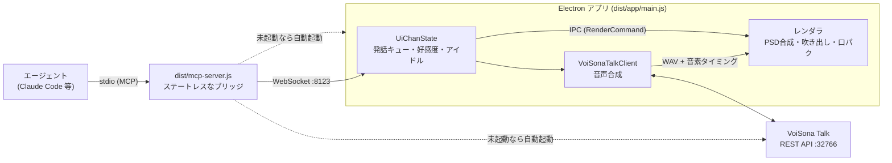

# ui-chan-mcp

デスクトップマスコットを MCP（Model Context Protocol）経由で操作するサーバ。
Claude Code や任意の MCP 対応エージェントから、マスコットの見た目（顔＋腕）と声をまとめて切り替え、
吹き出しでセリフを話させることができます。

- 表示層は Electron（透過・最前面・画面右下）
- 立ち絵は **PSDTool 形式の PSD**（`!`=必須レイヤー、`*`=ラジオ切替）をそのまま利用
- 見た目＋声は **Cue**（1ファイル=1つの完成した見た目＋声）という単位で管理。エージェント向けの
  視覚操作ツールは `set_cue` ただ1つ
- 発話キュー・複数エージェント同時接続に対応

> **立ち絵 PSD はリポジトリに含まれていません**（著作権保護された素材のため）。
> `assets/` に PSDTool 対応の PSD を置くと動きます。無い場合はプレースホルダで起動します。
> 同梱の `ui-chan.config.json` と `cues/*.json` は
> [雨衣（うい）立ち絵素材（坂本アヒル様）](https://ui-roid.booth.pm/items/8593427) のレイヤー構成向けです。
> 利用は[雨衣キャラクターガイドライン](https://www.ui-roid.com/guidelines/)の範囲でどうぞ。

## セットアップ

**→ [図解セットアップ手順](https://claude.ai/code/artifact/7baf161a-20a2-435d-ac9a-9da363be8be7)**
（クローンから画面に出るまで。人が読んでも AI が読んでも分かる粒度で書いてあります。
同じ内容が [docs/setup-page.html](docs/setup-page.html) にも入っています）

急ぐ人向けの要約：

```bash
git clone https://github.com/Uncle-Peke/ui-chan-mcp.git && cd ui-chan-mcp
npm install                     # 依存の取得 + ビルド（prepare で dist/ まで作られる）
cp .env.example .env            # VoiSona Talk の資格情報（音声を使わないなら不要）
# 立ち絵 PSD を assets/ に配置
npm run doctor                  # ビルド・PSD・資格情報・エンジン起動をまとめて確認
```

Claude Code につなぐ方法は 2 つ。**プラグインが推奨**です（MCP 登録・人格注入・アプリ起動が全部自動）。

```
/plugin marketplace add /path/to/ui-chan-mcp
/plugin install ui-chan@ui-chan
```

プラグインを使わない場合は MCP サーバを手で登録します。認証情報は `.env` から読まれるので
`env` は省略できます。

```bash
claude mcp add ui-chan -- node /path/to/ui-chan-mcp/dist/mcp-server.js
```

## アーキテクチャ

MCP サーバは薄いブリッジで、**状態はすべて Electron アプリ側に一元化**されています。
複数のエージェントが同時に繋いでも状態が食い違いません。



- **ポート** — `ui-chan.config.json` の `port`、または環境変数 `UI_CHAN_PORT`
- **自動起動** — アプリはセッション開始時（SessionStart フック）と各ツール呼び出し時に、
  VoiSona Talk は MCP 起動時と `set_cue` のたびに、落ちていれば起こし直されます
- **エージェント名** — MCP クライアント情報から自動取得（`UI_CHAN_AGENT_NAME` で上書き可）

より詳しい実装のガイドは [CLAUDE.md](CLAUDE.md) を参照。

## コマンド一覧

### MCP ツール（エージェントが呼ぶ）

| ツール | 引数 | 説明 |
|---|---|---|
| `set_cue` | `cue`, `text?`, `reading?`, `duration_ms?`, `pitch?`, `speed?`, `volume?`, `intonation?` | Cue（見た目＋声）を切り替え、任意でセリフを同時に話す。`text` を省略すると無言でCueだけ変わる。未知の `cue` 名は `default` にフォールバックし `note` が付く。`pitch`/`speed`/`volume`/`intonation` はその一行だけのアドリブ演技 |
| `get_state` | — | 現在の状態・接続エージェント・利用可能Cue・好感度・警告 |
| `adjust_affinity` | `direction`（`up`/`down`）, `magnitude`（`low`/`middle`/`high`） | 好感度を増減（セッション内のみ・再起動でリセット）。実際の増減量はエンジンが決めます |
| `clear` | — | 吹き出し・Cueを初期状態（`default`）にリセット |

Cue の一覧は `persona` プロンプト（と SessionStart フック）が `cues/*.json` から起動のたびに
生成してエージェントのコンテキストに渡します。

### スラッシュコマンド（プラグイン導入時）

| コマンド | 説明 |
|---|---|
| `/ui-chan <メッセージ>` | ういちゃんと会話する（作業はしない） |
| `/ui-mode [依頼]` | セッションごと憑依モードにする。以後の作業も会話もういちゃん本人として行う |
| `/ui-beam` | ういビーム。好感度が閾値未満なら撃ってくれない |
| `/eli14 [お題]` | 14才目線の図解で説明する（HTMLアーティファクト＋口頭解説） |
| `/mcp__ui-chan__persona` | 人格ファイルを編集したあとの読み込み直し |

### npm スクリプト

| コマンド | 説明 |
|---|---|
| `npm run doctor` | セットアップの事前チェック（ビルド・PSD・資格情報・エンジン） |
| `npm run app` / `stop` / `restart` | Electron アプリの起動／終了／再起動 |
| `npm run build` | `src/` を `dist/` にビルド（`npm install` 時に自動実行） |
| `npm run editor` | Cue エディタ「雨衣ちゃんのデバッグルーム」 |
| `npm run debug` | 対話型デバッグコンソール（MCP 不要・WebSocket 直叩き） |
| `npm run debug:launch` / `debug:restart` | アプリ起動込みのデバッグコンソール |
| `npm run debug:state` / `debug:list` | 状態の取得／Cue・IdlingCue 一覧 |
| `npm run dump-psd -- assets/foo.psd` | PSD レイヤー構造のダンプ |
| `npm run validate-cues` | `cues/*.json` のスキーマ検証 |
| `npm run lint` / `lint:fix` / `format` | Biome |
| `node tools/mcp-test.mjs` | MCP stdio 経由の E2E テスト |

## Q&A

<details>
<summary><b>ビルドはいつ必要？</b></summary>

`src/` の TypeScript を直したときだけ。`npm install` が `prepare` で1回ビルドするので、
クローン直後も `npm run build` を打つ必要はありません。Cue や `ui-chan.config.json` は
JSON なのでビルド不要です（Cue は保存すると即リロード）。

ただし **MCP サーバはセッション開始時のコードを抱えたまま動き続けます**。ビルドし直しても
そのセッションには反映されないので、MCP を繋ぎ直すかセッションを開き直してください。
</details>

<details>
<summary><b>声が出ない</b></summary>

`npm run doctor` を実行してください。よくある原因は、VoiSona Talk が未起動、
`.env` に資格情報が無い、VoiSona 側で REST API が有効になっていない、のどれかです。

声が出ない状態でも吹き出しは出ますし、口パクも `reading` のかなから動きます。
VoiSona は `set_cue` のたびに起こし直され（30秒に1回まで）、REST が応答するまで最大20秒待ちます。
`get_state` の `warnings` に理由が出ます。詳しくは [docs/TTS.md](docs/TTS.md)。
</details>

<details>
<summary><b>マスコットが画面に出てこない</b></summary>

まず `npm run app` で単体起動を試すと切り分けられます。プラグイン導入時は
SessionStart フックが起動を試みるので、通常はセッションを開くだけで出てきます。
PSD が `assets/` に無い場合はプレースホルダ表示になります。
</details>

<details>
<summary><b>新しい表情（Cue）を追加したい</b></summary>

`cues/<名前>.json` を1ファイル作るだけです。継承なし・完全に自己完結で、保存すると即リロードされます。
ビジュアルに作るなら `npm run editor`。書式とレイヤー指定は
[docs/CUES_AND_CONFIG.md](docs/CUES_AND_CONFIG.md)、PSD レイヤー名の早見表は
[docs/CUES.md](docs/CUES.md)。
</details>

<details>
<summary><b>性格やセリフを変えたい</b></summary>

`persona/ui-chan.md`（基本人格とツール使用方針）と `context/*.md`（`SOUL.md` 価値観 /
`VOCABULARY.md` 語彙・NGワード / `AFFINITY.md` 好感度）です。`context/` に置いた Markdown は
ファイル名順に全部エージェントへ注入されます。詳しくは [docs/PERSONA.md](docs/PERSONA.md)。
</details>

<details>
<summary><b>アイドル中の独り言がうるさい／静かすぎる</b></summary>

`ui-chan.config.json` の `idle.idlingCues` にある `minSec` / `maxSec`（既定 45〜120秒）で間隔を、
各 IdlingCue の `weight` で出やすさを調整します。`minAffinity` / `maxAffinity` で
好感度による出し分けもできます。
</details>

<details>
<summary><b>別のキャラクターに差し替えたい</b></summary>

`npm run dump-psd -- path/to/file.psd` でレイヤー名を確認し、`ui-chan.config.json` と
`cues/*.json`（土台は `cues/default.json`）を書き換えます。人格側は `persona/` と `context/` を
丸ごと差し替えてください。存在しないレイヤーパスは無視され `get_state` の `warnings` に出るので、
差し替え作業中もクラッシュはしません。
</details>

<details>
<summary><b>ういビームが撃てない</b></summary>

好感度が閾値（65）に届いていません。感謝・気遣い・覚えていてくれること で上がります。
直球の好意表現はむしろ下がります。
</details>

## ドキュメント

| ファイル | 内容 |
|---|---|
| [docs/CUES_AND_CONFIG.md](docs/CUES_AND_CONFIG.md) | Cue ファイルの書式と `ui-chan.config.json` の全設定項目 |
| [docs/CUES.md](docs/CUES.md) | PSD レイヤー名カタログ（新規Cue制作用・人間向け） |
| [docs/PERSONA.md](docs/PERSONA.md) | 人格の定義場所と注入方法 |
| [docs/TTS.md](docs/TTS.md) | VoiSona Talk 連携の詳細 |
| [docs/setup-page.html](docs/setup-page.html) | 図解セットアップ手順（公開アーティファクトの実体） |
| [docs/PLUGIN_UPDATE.md](docs/PLUGIN_UPDATE.md) | プラグインの更新手順 |
| [CLAUDE.md](CLAUDE.md) | 実装ガイド（AI・コントリビュータ向け） |
| [VISION.md](VISION.md) | 用語とコンセプト |
