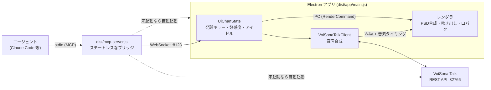

# 開発ガイド

**ういちゃんMCP そのものを直す人向け。** 使うだけなら [../README.md](../README.md) を。

コードの設計判断と「なぜそうしたか」は [../CLAUDE.md](../CLAUDE.md) に、用語は
[../VISION.md](../VISION.md) にあります。ここはその手前——動かし方と全体像です。

## 開発の準備

```bash
git clone https://github.com/Uncle-Peke/ui-chan-mcp.git && cd ui-chan-mcp
npm install          # 依存の取得 + ビルド（prepare で dist/ まで）
npx ui-chan          # 対話セットアップ
npx ui-chan use      # クライアントの参照先をこのクローンに向ける（npm 版も入れている場合）
```

`npx ui-chan doctor` が「このコピー」と、各クライアントがどのコピーを指しているかを表示します。
**npm 版とクローンを同時に入れても構いません** — どちらが動くかはクライアントの設定に
書かれたパスで決まり、`ui-chan use` を打ったコピーが担当になります。

## コマンド

| コマンド | 説明 |
|---|---|
| `npx ui-chan` | 対話セットアップ（TUI） |
| `npx ui-chan update` | 本体を最新にして再ビルド（`--check` で確認のみ、`--branch <名前>` で追従先指定） |
| `npx ui-chan use` | 登録済みクライアントの参照先を「このコピー」に切り替える |
| `npm run doctor` | セットアップの事前チェック（＝`ui-chan doctor`） |
| `npm run app` / `stop` / `restart` | Electron アプリの起動／終了／再起動 |
| `npm run build` | `src/` を `dist/` にビルド（`npm install` 時に自動実行） |
| `npm run editor` | Cue エディタ「雨衣ちゃんのデバッグルーム」 |
| `npm run dump-psd -- assets/foo.psd` | PSD レイヤー構造のダンプ |
| `npm run validate-cues` | `cues/*.json` のスキーマ検証 |
| `npm run lint` / `lint:fix` / `format` | Biome |
| `node tools/mcp-test.mjs` | MCP stdio 経由の E2E テスト |

## パッケージとユーザーデータ

**アップデートしても壊れない**のはこれのおかげ。

| | 場所 | 中身 | 更新時 |
|---|---|---|---|
| パッケージ | クローン／`node_modules` | コード・同梱Cue・人格・設定の既定値 | **まるごと入れ替わる** |
| ユーザーデータ | `~/.ui-chan/`（`UI_CHAN_HOME` で変更可） | PSD・`.env`・`config.json`・自作Cue・人格の上書き | **触られない** |

上書きしたいものだけ書けばいいよ。全部コピーしてこなくていい。

- `config.json` … 同梱の設定に**深いマージで上書き**。3行だけ書いても、後から増えた項目はちゃんと引き継ぐ
- `cues/` … 同梱のと**両方読む**。同じ名前ならきみのが勝つ。1個足すのにカタログ全部を複製しなくていいの
- `context/` … 同じくファイル名単位。`persona/ui-chan.md` も置けばそっちを使う
- `assets/` … 立ち絵。配れないから実質ここだけ
- `.env` … 環境変数があればそっちが優先

## 変更が反映されるタイミング

| 直したもの | 反映 |
|---|---|
| `cues/*.json` | **保存した瞬間**（ホットリロード） |
| `ui-chan.config.json` | アプリの再起動 |
| `persona/*.md`・`context/*.md` | 次のセッション（またはプロンプト `persona` の再実行） |
| `src/**` | `npm run build` → アプリ再起動。**MCP サーバはセッション開始時のコードを抱えたまま動く**ので、繋ぎ直すかセッションを開き直す |

レンダラ（`src/renderer/`）は tsc だけでは反映されません。esbuild が要るので `npm run build` を使ってください。

## アーキテクチャ

MCP サーバは薄いブリッジで、**状態はすべて Electron アプリ側に一元化**されています。
複数のエージェントが同時に繋いでも状態が食い違いません。



- **ポート** — `ui-chan.config.json` の `port`、または環境変数 `UI_CHAN_PORT`
- **自動起動** — アプリはセッション開始時（SessionStart フック）と各ツール呼び出し時に、
  VoiSona Talk は MCP 起動時と `set_cue` のたびに、落ちていれば起こし直されます
- **エージェント名** — MCP クライアント情報から自動取得（`UI_CHAN_AGENT_NAME` で上書き可）

より詳しい実装のガイドは [CLAUDE.md](../CLAUDE.md) を参照。

